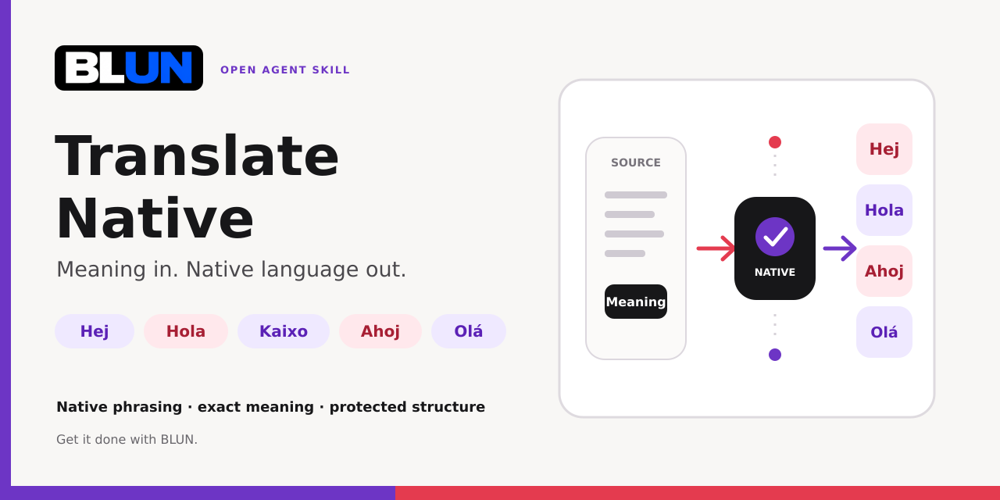

<p align="center">
  
</p>

<div align="center">

<pre>
 ____  _     _   _ _   _
| __ )| |   | | | | \ | |
|  _ \| |   | | | |  \| |
| |_) | |___| |_| | |\  |
|____/|_____|\___/|_| \_|
</pre>

# Translate Native

### Meaning in. Native language out. Release only after proof.

One universal agent skill for translations that sound written—not translated—and preserve every language's native script.

<p>
  
  
  
  
  
</p>

**Built by BLUN · Skill + MCP + enforced release gate.**

</div>

---

> **Stop translating strings. Start rewriting meaning in the target language.**

Agents can speak beautifully with users in their own language and still produce stiff, literal copy as soon as the task is called “translation” or arrives inside an i18n file. Translate Native prevents that mode switch.

It reconstructs the meaning, discards the source sentence structure, and writes the message again with native syntax, rhythm, idiom, register, script, punctuation, and locale conventions—without changing the facts.

## One skill. Every human language.

The skill has no language allowlist. It applies equally to:

- Swedish, German, Czech, Spanish, Catalan, Basque, and every other Latin-script language;
- Chinese, Japanese, and Korean;
- Arabic, Persian, Urdu, and Hebrew;
- Greek, Cyrillic, Armenian, and Georgian writing systems;
- Indic, Southeast Asian, Indigenous, minority, endangered, and low-resource languages;
- regional standards, scripts, dialects, honorific systems, and specialist registers.

For uncertain and low-resource varieties, the rule is honesty: verify with community and authoritative sources, or request native review. Never fake fluency.

## What changes

| Ordinary translation mode | Translate Native |
| --- | --- |
| Mirrors source word order | Rebuilds native information flow |
| Chooses dictionary equivalents | Chooses native collocations |
| Produces generic “i18n language” | Writes for the real audience and medium |
| Flattens locale and script choices | Resolves locale, script, dialect, and register |
| Drops accents or romanizes native text | Preserves native spelling, diacritics, alphabets, scripts, and punctuation |
| Silently changes emphasis | Preserves claims, modality, negation, and uncertainty |
| Breaks variables during rewriting | Protects keys, placeholders, URLs, markup, and code |

## Two jobs. One mandatory skill.

Agents no longer need to activate a second orthography skill after translating. `translate-native` now owns both jobs in one self-contained release gate:

1. rewrite the meaning as natural original target-language prose;
2. enforce native spelling, diacritics, alphabets, scripts, punctuation, spacing, and Unicode.

The separate `native-diacritics` skill can still protect ordinary writing outside translation tasks. Inside a translation, its activation is optional because the full orthography contract is built directly into `translate-native`.

The root [`AGENTS.md`](AGENTS.md) tells repository-aware agents to load the combined workflow and treat every model-generated translation as an untrusted draft.

## Version 6: mandatory native output for every agent answer

Version 6 extends the gateway beyond translations. Every user-visible natural-language answer now has a release path:

```text
Agent candidate
      ↓ trusted host classifies the task and supplies the expected locale
      ├── response    → release_response
      └── translation → translate-native skill/plugin → release_translation
      ↓
PASS + purpose-bound receipt → deliver
BLOCK                        → revise or stop
```

`release_response` validates the agent's own answer for Unicode integrity, expected script, native spelling and measurable ASCII folding. It rejects `auto` and `all`: the trusted host must supply the exact language or locale rather than letting the agent choose a convenient label. A German answer such as `Haendler pruefen taeglich die Qualitaet im Buero` blocks; the correctly written `Händler prüfen täglich die Qualität im Büro` can pass.

Translations always take the separate, stricter path. The MCP initialization response tells compatible agents to load the installed `translate-native` skill/plugin before drafting, exposes the same workflow as the MCP prompt `translate-native`, and requires `release_translation` for the complete source-target pair. Translation and response receipts are purpose-bound, so a response receipt cannot authorize a translation.

The portable gateway requires a host-owned `task_kind`:

```json
{
  "task_kind": "response",
  "target_text": "Natürlich können wir das zuverlässig prüfen.",
  "language": "de-DE",
  "attestations": {"nativeness": true, "orthography": true}
}
```

For a translation, use `"task_kind": "translation"`, include the complete `source_text`, and supply all seven translation attestations. The gateway blocks ambiguous task kinds, a translation without source, and any attempt to carry a source through the response route.

This covers every human language and writing system, not only German umlauts. The same contract protects Swedish `å/ä/ö`, Czech `č/ř/š/ž`, Spanish accents and punctuation, Vietnamese tone marks, Greek, Cyrillic, Arabic, Hebrew, Indic scripts, Chinese, Japanese, Korean, and languages not named here. Deterministic checks are intentionally conservative and cannot prove perfect native wording; the native-language workflow and human review remain necessary where consequences are material.

### What “mandatory” really means

An MCP server cannot physically stop an agent that is still allowed to print directly to its terminal, Telegram bridge, API response, or file. Non-bypassable enforcement requires the host to capture the complete candidate output, assign `task_kind` and the expected locale outside the agent's control, call the gateway, verify the purpose-bound receipt, and withhold delivery on every failure. If the agent controls the wrapper, signing key, task classification, source, or delivery channel, the installation is advisory.

Version 6.1 therefore installs [`enforced_delivery.py`](integrations/enforced_delivery.py) as `blun-language-deliver`. In mandatory mode the untrusted agent may emit only this envelope:

```json
{
  "target_text": "Natürlich können wir das zuverlässig prüfen.",
  "release_token": "blg6.…"
}
```

The host—not the envelope—supplies `task_kind`, `language`, `source_text`, and content policy. Any attempt by the agent to include or override those fields blocks delivery. Raw text, invalid JSON, a missing token, an edited target, a wrong locale, an expired token, a response token used for translation, an unavailable guard, or a missing key all produce an empty stdout and a nonzero exit.

The wrapper exposes its trusted classification to the child as read-only process context through `BLUN_LANGUAGE_GUARD_MANDATORY`, `BLUN_LANGUAGE_GUARD_TASK_KIND`, `BLUN_LANGUAGE_GUARD_LANGUAGE`, and `BLUN_LANGUAGE_GUARD_CONTENT_TYPE`. This lets the agent call the correct MCP release tool with the expected locale. Changing those variables inside the child cannot change the host policy used for final verification.

Wrap a non-interactive, JSON-only agent command like this:

```bash
blun-language-deliver \
  --task-kind response \
  --language de-AT \
  -- your-agent-command --json-only
```

For translation the trusted host captures the complete source independently and chooses the stricter route:

```bash
blun-language-deliver \
  --task-kind translation \
  --language sv-SE \
  --source-file /trusted/job/source.txt \
  -- your-agent-command --json-only
```

The same module exposes `guarded_send` and `guarded_send_async` for API, Telegram, queue, and web-response adapters. These functions verify before invoking the supplied sender and never invoke it on failure. The host must remove every alternate sender: an agent with direct Telegram/API credentials or an unwrapped stdout path can still bypass any guard.

For a genuine security boundary, run the MCP signer and delivery verifier under a separate OS identity, container, or remote service. The agent must be unable to read the signing key, modify the gateway, change trusted source files, administer the delivery socket, or call the final channel directly. Same-user installation is strong workflow enforcement, not protection against a hostile process with filesystem access.

### Version 6.42.0: hardened Claude hooks become update-visible

Version 6.42 publishes the accumulated Stop and SubagentStop hardening under a new plugin cache key. Claude Code uses the explicit manifest version to decide whether an installed marketplace plugin needs an update; leaving the version at 6.41.1 would make existing installations report that they were current while retaining the older cached hooks.

`VERSION`, the Claude manifest, the active skill contract, and this README now identify Version 6.42.0 consistently. A repository regression prevents those active version declarations from drifting apart again; every later plugin release must still advance the explicit version with its changed bytes. See Anthropic's official [plugin version-management reference](https://code.claude.com/docs/en/plugins-reference#version-management).

### Version 6.41.1: strict Claude plugin paths

Version 6.41.1 fixes the two remaining path violations reported by Claude's strict plugin validator. The marketplace now declares its repository-root source as `./`, satisfying Claude's requirement that relative marketplace sources start with `./`. The manifest's `skills` entry now names the `./translate-native` directory that contains `SKILL.md`, rather than naming the Markdown file as if it were a skill directory.

The version is bumped because Claude uses the manifest version as the plugin cache and update key; publishing corrected bytes under Version 6.41.0 would leave existing installations unchanged. A repository regression now resolves every declared skill path to a directory containing `SKILL.md` and rejects marketplace sources that do not use Claude's strict relative-path form. Hooks, MCP configuration, delivery policy, and live processes are unchanged. See Anthropic's official [plugin path rules](https://code.claude.com/docs/en/plugins-reference#path-behavior-rules) and [marketplace source rules](https://code.claude.com/docs/en/plugin-marketplaces#relative-paths).

### Version 6.41.0: Claude blocks direct Telegram delivery

Version 6.41 enforces the existing host-owned delivery contract at Claude's tool boundary. A Claude agent can no longer call a Telegram `reply`, `send`, `send_message`, or `sendMessage` MCP tool before its actual final response reaches `Stop`. The `PreToolUse` hook denies only those delivery operations, never copies their candidate text into the denial, and remains closed even when the language service is unavailable. Read-only Telegram operations remain unaffected.

The agent returns its verified final response normally. After `Stop` consumes the fresh grant bound to the exact response, the host-owned bridge remains responsible for delivery. This prevents a direct Telegram tool call from escaping before the lifecycle gate while preserving the non-bypassable host boundary. The implementation follows Anthropic's official [hook reference](https://code.claude.com/docs/en/hooks), where `PreToolUse` can deny a tool call before execution. Regression tests cover the observed `plugin-telegram_telegram.reply` path, candidate confidentiality, and a read-only Telegram control.

### Version 6.40.0: Claude binds release calls to the host language

Version 6.40 closes the remaining Claude-side path behind delayed `language mismatch` failures. When the trusted host supplies `BLUN_LANGUAGE_GUARD_LANGUAGE` or `BLUN_LANGUAGE_GUARD_TASK_KIND`, the plugin repeats that policy at session and prompt boundaries, rewrites the release tool's `language` argument to the exact host tag in `PreToolUse`, and rejects a wrong release purpose. `PostToolUse` independently rechecks both fields before exchanging the receipt for a delivery grant, so an older client, hook race, or direct invocation cannot bypass the binding.

No locale equivalence is introduced: `de`, `de-DE`, and `de-AT` remain distinct signed values. Installations without either host variable retain the existing behavior, while an explicitly present but malformed policy fails closed. The implementation follows Anthropic's official [hook reference](https://code.claude.com/docs/en/hooks): `PreToolUse` may return `updatedInput`, and `UserPromptSubmit` may inject `additionalContext`. Regression tests cover automatic `de-DE` correction, wrong-purpose denial, invalid-policy denial, prompt reinforcement, exact post-tool enforcement, and the no-policy compatibility path.

### Version 6.39.0: authoritative reply language wins over Telegram UI language

Version 6.39 fixes a real delivery failure in which Telegram's `senderLanguageCode` could override the host's configured response locale. That Telegram field describes the sender's client/interface language and is not reliable evidence for the language of the current message. A German release such as `de-DE` could therefore be checked against `en` or another short UI tag and fail with `language mismatch` even though the text was correct.

The BLUN adapter now resolves the language in a strict trust order: explicit per-task guard language, dedicated guard or response configuration, general host language, explicit Telegram conversation language, and only then the legacy sender UI language as a compatibility fallback. The chosen tag is still preserved exactly—`de`, `de-DE`, and `de-AT` are not treated as interchangeable—and the mandatory agent instruction now names the exact release-tool argument. Rejections also identify failed receipt fields without exposing protected text. Regression tests cover configured German with an English Telegram UI, explicit Swedish routing, Catalan conversation metadata, and diagnostic failure output.

### Version 6.38.0: update verifies the checkout after repository tests

Version 6.38 closes the post-test race in forward updates. Post-update tests run without creating Python bytecode, and the updater then requires the exact completely clean tested candidate before any persistent runtime, Claude integration, health monitor, or update state can change.

If uncommitted work appears during the tests, the updater restores the previous revision only through `reset --keep` and preserves the new bytes. If another process creates a commit, it leaves that independent history untouched and does not execute it through an automatic restart. The same rule protects the failing-test path, so a failed candidate can never reset a concurrent commit. Regression tests cover passing and failing tests against both uncommitted and committed races.

### Version 6.37.0: rollback verifies the checkout after runtime probes

Version 6.37 closes the final rollback window between repository tests and updater-state publication. After installed runtimes restart and the optional Claude cache is checked, the repository must still be the exact completely clean tested target before the scheduler is removed or rollback success is recorded.

If uncommitted work appears during runtime verification, rollback safely restores both the forward revision and its runtimes without discarding the new bytes. If another process creates a commit, it leaves that independent history untouched and does not execute it through an automatic restart. Both paths preserve the updater schedule and prior state. Regression tests prove exact `HEAD`, byte preservation, bounded restart behavior, and the absence of scheduler mutation.

### Version 6.36.0: rollback verifies the checkout after repository tests

Version 6.36 closes the remaining test-time race in emergency rollback. The tested ancestor must still be the exact completely clean checkout after its post-rollback test suite finishes and before any installed runtime is restarted or the automatic-update scheduler is changed.

If the tests or another process leave uncommitted work, rollback restores the forward revision only through `reset --keep` and preserves those bytes. If another process creates a commit, the guard leaves that independent history untouched, blocks runtime activation, and requires inspection. Regression tests prove both outcomes and verify that blocked transitions perform no runtime restart or scheduler removal.

### Version 6.35.0: rollback rechecks both sides of the cutover

Version 6.35 applies the updater's complete clean-checkout contract to emergency rollback. Rollback now starts only from a valid exact `HEAD` with every tracked, staged, and untracked path clean, and rechecks that identical revision after candidate tests and Claude cache preflight immediately before changing the repository.

Immediately after `git reset --keep` selects the tested ancestor, rollback requires that exact target and a completely clean checkout before post-tests or runtime activation begin. If uncommitted work appears during cutover, it safely restores the forward revision with `reset --keep` and preserves the new bytes. If another process creates a commit, rollback never rewrites it and blocks runtime activation for manual inspection. Regression tests exercise both dirty and committed races on both sides of the cutover and prove that scheduler removal and runtime restarts never run after a blocked transition.

### Version 6.34.0: update cutover rechecks both sides of the fast-forward

Version 6.34 closes the remaining network and cutover windows in the clean-checkout contract. After the tested revision is fetched, the updater rechecks the exact pre-update `HEAD` and every tracked, staged, and untracked path before running the fast-forward. Work created while the network request is in progress therefore blocks before the repository moves.

Immediately after a successful fast-forward, the updater requires the exact tested revision and a clean checkout before post-update tests or persistent-runtime activation can begin. If uncommitted work appears during the cutover, the updater attempts `git reset --keep`: it returns to the previous revision only when Git can preserve those bytes, otherwise it leaves the state for manual inspection. If another process creates a commit, the updater never resets that independent history. Fetch-time dirty work, fetch-time commits, cutover-time dirty work, and cutover-time commits are separate regression cases.

### Version 6.33.0: automatic updates never mix with local work

Version 6.33 makes a completely clean active checkout a precondition for automatic and manual repository updates. Tracked edits, staged changes and untracked files now block before the temporary candidate is cloned or any repository-owned candidate test can execute. The updater never stashes, resets, deletes or overwrites local work.

The same clean-state and exact-`HEAD` check runs again after candidate tests and Claude plugin preflight, immediately before fetch and fast-forward. If another process edits the checkout or advances its commit during that window, activation stops while both the tested candidate and the local work remain untouched. Rollback already required a clean checkout; forward update now enforces the same fail-closed contract.

### Version 6.32.0: maintenance locks identify the process generation

Version 6.32 prevents a crashed updater's old lock from becoming immortal when the operating system later reuses the same numeric PID for an unrelated process. New locks bind their PID to an immutable process-start identity: Linux combines the kernel boot ID with the process start tick, Windows uses the process creation time through a read-only Win32 handle, and other POSIX systems hash the start timestamp reported by `ps`.

An old lock is recovered only when the PID is dead or the stored and observed process generations definitely differ. If the platform cannot prove the current generation, the lock remains fail-safe and is not removed. Locks written by Version 6.31 remain compatible: a live legacy PID without a generation field is preserved. Exact file-identity checks still protect both stale recovery and normal release from concurrent replacement.

### Version 6.31.0: live maintenance locks cannot expire underneath their owner

Version 6.31 closes a race between long update, rollback and health-monitor operations. The shared lock no longer becomes removable merely because its timestamp is older than 30 minutes. A validated lock whose process is still alive remains authoritative for its complete lifetime, so a slow test suite or plugin preflight cannot be overtaken by a repair process.

Recovery still works after a crash: only an old lock with a confirmed dead owner, or an old malformed lock with no trustworthy owner, may be replaced. Before either stale recovery or normal release deletes anything, the installer rechecks that the path still names the exact file instance it inspected. A concurrently replaced lock is therefore preserved. Lock reads are bounded, regular-file-only and no-follow where the platform supports it; process liveness is checked without sending a signal that changes process state.

### Version 6.30.0: updater policy files are fail-closed inputs

Version 6.30 treats both active and rollback-paused updater policies as security-sensitive input at every public updater path. Policy reads now reject symbolic links, directories, FIFOs and other special files before opening them; cap input at 64 KiB; and validate the stored Boolean, interval, repository and Claude-command field types. `status`, scheduled `run`, direct update, rollback, reconfiguration and the doctor therefore fail closed instead of following a redirected file, hanging on a pipe or crashing on malformed schema.

Atomic JSON writes now use an unpredictable owner-only temporary file in the destination directory, flush it before replacement and always clean it up. A pre-created legacy `updater.json.tmp` link can no longer redirect policy output into another file. Existing regular policy files remain compatible. `auto-update disable` preflights both active and rollback-paused policies before scheduler mutation, then removes only the exact file identities it inspected; unsafe or concurrently exchanged policy state blocks fail-closed.

### Version 6.29.0: reconfiguration preserves signed-update enforcement

Version 6.29 closes the remaining configuration-time downgrade path in the signed-commit policy. Re-running `auto-update enable` to change an interval or repair a scheduler now resolves the same monotonic active and rollback-paused policy before writing configuration. Omitting `--require-signed-commits` therefore cannot overwrite a stored `true`, and restoring automatic updates after rollback cannot discard the paused requirement.

If either stored policy is malformed, non-Boolean, unreadable, linked, or exchanged during reconfiguration, activation stops before scheduler installation. The active replacement and paused-policy removal are each bound to the exact identities read during monotonic policy resolution, so a concurrent replacement is preserved rather than overwritten or deleted. The deliberate escape path remains explicit and auditable: run `auto-update disable` to remove both policies, then enable again without the signature option.

Regression tests cover interval-only reconfiguration, reactivation from a paused signed policy, preservation of invalid or concurrently replaced policy bytes, linked paused state, and the explicit disable-then-enable reset control.

### Version 6.28.0: signed-update policy cannot be downgraded by omission

Version 6.28 makes the optional signed-commit policy monotonic across every updater entry point. After signature enforcement is enabled, a direct `update` call without `--require-signed-commits` can no longer silently fall back to unsigned mode. The updater resolves the effective policy by combining the caller request with both the active automatic-update policy and the policy paused after a successful rollback; any stored `true` remains authoritative.

Malformed JSON, a non-object policy, or a non-Boolean `require_signed_commits` value now blocks update and rollback fail-closed before candidate testing or active mutation. This prevents values such as the string `"false"` from being interpreted inconsistently. Disabling automatic updates still explicitly removes both stored policies, preserving the existing operator-controlled escape hatch.

Regression tests prove that an unsigned candidate cannot execute its import-time marker through a flagless direct update, that the paused rollback policy reaches the update worker as `true`, and that a type-invalid policy never invokes the worker.

### Version 6.27.0: verify trust before executing candidate code

Version 6.27 closes an updater supply-chain gap in the optional signed-commit policy. Previously, a clean clone ran its repository-owned test suite before `git verify-commit` rejected an unsigned update or rollback target. Test discovery imports Python modules, so a rejected commit could execute code even though it never became active.

When `require_signed_commits` is enabled, both forward update and rollback now resolve and verify the exact checked-out commit immediately after clone or checkout. Only a trusted signature permits test discovery, candidate metadata reads, Claude preflight, fetch, merge, or runtime work. Signature rejection leaves the active checkout and every installed runtime unchanged. The default remains compatible: installations that do not require signed commits continue to test unsigned candidates before activation.

The regression tests place an observable import-time marker inside an unsigned candidate and an unsigned rollback target. Both operations must reject the commit while the marker remains absent, proving that the result is not merely a later rollback after code execution.

### Version 6.26.0: fail-closed Claude preflight before runtime cutover

Version 6.26 closes the split-version window caused by discovering a deterministic Claude plugin failure only after the repository, signer, and MCP had already advanced. When the Claude plugin is installed, the updater now validates the clean temporary candidate with Claude's strict validator, refreshes only the trusted marketplace, and proves exact catalog-version equality while the active checkout and both persistent runtimes are still untouched.

Only a successful preflight permits the fast-forward and runtime restarts. The later plugin-cache step consumes that exact expected-version preflight instead of repeating mutation-prone discovery. Validator failure, marketplace failure, catalog drift, an unavailable Claude executable, or process loss records a degraded retry while preserving the active commit, services, and installed cache. A disappearing plugin between preflight and application also fails closed. Tests prove the preflight never invokes `plugin update`, a rejected candidate does not fetch, merge, restart, or create its new runtime file, and process loss becomes a structured failure instead of crashing the scheduler.

The unavoidable residual race is explicit: Claude's documented update command targets the latest marketplace version rather than a pinned content digest. Final enabled-state, load-error, and exact-version verification therefore remains mandatory after application; any mismatch leaves delivery degraded and fail-closed.

### Version 6.25.0: Claude-native strict validation before update

Version 6.25 closes the schema-authority gap in automatic Claude plugin maintenance. Repository tests can verify the files and the BLUN contracts, but they are not Claude Code's own parser. Before refreshing a marketplace or touching an installed cache, the updater now runs the documented `claude plugin validate <plugin-root> --strict` command against the exact repository candidate that already passed the full test suite.

Any validator error or warning treated as an error blocks before marketplace refresh and before `plugin update`; the previously installed cache remains unchanged and maintenance is reported as degraded. A valid candidate continues through the Version 6.24 trusted-marketplace refresh, exact catalog-version equality check, official user-scope update, and final installed-version, enabled-state, and load-error verification. An already exact healthy cache remains a no-op.

### Version 6.24.0: tested-version marketplace synchronization

Version 6.24 closes a stale-catalog gap in automatic Claude plugin maintenance. Anthropic documents marketplace refresh and plugin update as separate CLI operations: `plugin marketplace update` retrieves version changes, while `plugin update` installs the latest version known to that marketplace. Calling only the latter could therefore leave an old catalog and old hooks in place even though the updater had already tested a newer repository revision.

For an already-installed but stale plugin, the updater now refreshes only `blun-language-tools`, inspects the refreshed public catalog with `plugin list --available --json`, and requires its advertised version to equal the fully tested runtime version before it invokes the official user-scope plugin update. Refresh failure, invalid catalog output, a missing plugin, catalog/runtime drift, update failure, disabled state, load errors, or final version mismatch all remain degraded and fail-closed. An already exact, enabled, error-free cache stays a no-op. The updater still never installs a missing plugin or claims that an existing session has reloaded downloaded hooks.

### Version 6.23.0: service-authoritative session retirement

Version 6.23 handles Claude's `SessionEnd` lifecycle event as an authoritative cleanup boundary. Anthropic documents that this event runs when a session terminates, including `/clear` and switching sessions through interactive `/resume`, and that it is intended for cleanup rather than decision control. The plugin therefore removes the owner-only local epoch and every grant record for that exact session before it contacts the isolated service. Another concurrent session and its grants remain untouched.

The service retires the epoch only when the request names the exact epoch that is still current, then replaces it with an undisclosed random tombstone. A delayed cleanup from an older session lifecycle cannot overwrite a newer `SessionStart` epoch. Restoring a deleted marker and grant afterward remains blocked by the service; a later genuine startup or resume registers a fresh epoch and restores normal one-time delivery. The hook uses a 700 ms service deadline and a one-second command timeout so local fail-closed cleanup completes within Anthropic's documented 1.5-second overall `SessionEnd` budget. It emits no output and cannot pretend to block termination.

### Version 6.22.0: service-authoritative API-failure revocation

Version 6.22 makes `StopFailure` invalidation authoritative at the isolated service instead of relying only on deletion of local hook records. Every failed Claude turn now rotates that session's random epoch through the guard service. All earlier main-agent and subagent delivery grants are therefore invalid even if an old local grant record and its matching epoch marker are later restored. A parallel session retains its independent epoch and grants.

The rotation removes the old local epoch before asking the isolated service to register its replacement and writes the new owner-only marker only after confirmation. If the guard is unavailable, rejects the epoch, or the marker cannot be replaced, the session remains deliberately fail-closed until a later `SessionStart` repairs it. After a successful rotation, a fresh exact response or translation release works normally and remains one-time. The hook still emits nothing because Anthropic documents `StopFailure` output and exit status as ignored.

### Version 6.21.0: invalidate grants after API failure

Version 6.21 handles Claude's `StopFailure` lifecycle event, which Anthropic documents as running instead of `Stop` when a turn ends because of an API error. A rate limit, authentication failure, server error, output-limit failure, or other API failure now removes every unconsumed main-agent and subagent delivery grant belonging to that exact Claude session. A later retry must therefore obtain a fresh response or translation release; another concurrent session remains untouched.

The cleanup is deliberately silent. Anthropic documents that `StopFailure` output and exit status are ignored, so the hook does not pretend it can block or guide Claude at this event. It emits no candidate, rendered API error, or diagnostic detail. The next `UserPromptSubmit`, `Stop`, and `SubagentStop` boundaries remain fail-closed if protected state is unavailable or could not be removed.

### Version 6.20.0: safe recovery after guard-service restart

Version 6.20 lets an already running Claude session recover after the isolated guard service restarts. Anthropic's official [hooks reference](https://code.claude.com/docs/en/hooks) describes `SessionStart` as a session lifecycle event, so restarting an independent local service does not itself create a new Claude startup boundary. Version 6.19 therefore invalidated old grants safely but also left the restarted service without the active session epoch until Claude restarted or resumed.

The service may now recover a missing epoch only inside `authorize_delivery` and only after it has cryptographically verified a fresh response or translation receipt. It never recovers during grant consumption. A forged or rejected receipt cannot enroll a session; a different epoch already registered during the current service boot still blocks; every pre-restart grant remains invalid because its signed service-boot identity changed. The next successful release call restores availability without weakening fail-closed behavior or recording the raw epoch in the audit log.

### Version 6.19.0: service-authoritative session epochs

Version 6.19 closes the remaining two-file replay path in the Claude hook. Version 6.18 rejected an old local grant record after `SessionStart` rotated its epoch marker, but restoring both the record and its matching old marker could recreate the local state. The isolated guard service now registers the active epoch for each hashed Claude session and atomically requires that registered value before issuing or consuming any delivery grant.

Every startup, resume, clear, compaction, or fork therefore replaces the service-authoritative epoch as well as the owner-only local marker. Previously registered epochs cannot be registered again during the same service boot. Restoring both old files, authorizing against an obsolete epoch, replaying an earlier registration, or losing the registration response blocks; another session remains independent. The service retains only session and epoch hashes, and neither the raw epoch nor candidate text enters its audit log. Anthropic's official [hooks reference](https://code.claude.com/docs/en/hooks) documents these `SessionStart` lifecycle sources.

### Version 6.18.0: session-resume-bound delivery grants

Version 6.18 prevents an unconsumed delivery grant from surviving a Claude session restart, `--resume`, `--continue`, `/resume`, `/clear`, or context compaction. Anthropic's official [hooks reference](https://code.claude.com/docs/en/hooks) states that `SessionStart` runs for each of those lifecycle sources, including resumed sessions. The plugin now rotates a cryptographically random delivery epoch on every `SessionStart`, removes the session's outstanding main-agent and subagent records, and requires that epoch before it will authorize any new release.

The isolated service signs only the epoch's SHA-256 binding into each delivery grant and checks the live epoch again during one-time consumption. The raw epoch remains in an owner-only local marker and never enters the grant, audit log, candidate diagnostics, or skill text. A copied pre-resume record, missing marker, unsafe marker permissions, failed rotation, cross-session epoch, or old pre-6.18 record blocks; the final `Stop` and `SubagentStop` checks therefore remain fail-closed even if stale local JSON is restored after resume.

### Version 6.17.0: invalidate grants on every rejected release

Version 6.17 closes the logical-failure half of the stale-grant path. A release tool can execute successfully while returning no usable receipt, while the isolated verifier rejects that receipt, or while delivery authorization becomes unavailable. The synchronous `PostToolUse` hook now clears any earlier grant for the exact session and agent before processing every new release attempt and clears it again on every rejection path. A failed new attempt can therefore never fall back to an older authorization.

The second invalidation is deliberate: Anthropic's official [hooks reference](https://code.claude.com/docs/en/hooks) documents that `PostToolUse` hooks run concurrently for parallel tool calls. Rechecking on rejection ensures that a later failure removes a grant written by an overlapping earlier attempt, while a later successful attempt may still establish its own exact grant. Missing receipts, verifier rejection, verifier outages, protected-state deletion failures, cross-session isolation, privacy-safe diagnostics, and ordinary success all have regression coverage.

### Version 6.16.0: fail closed after release-tool failures

Version 6.16 closes the stale-grant path that appears when Claude's MCP release call fails. Anthropic's official [`PostToolUseFailure` hook contract](https://code.claude.com/docs/en/hooks) can add recovery context alongside the tool error and can return a blocking decision. The plugin now matches only failed `release_response` and `release_translation` calls, immediately removes any earlier unconsumed delivery grant for that exact Claude session and agent, and tells Claude to reconnect and repeat the correct release workflow.

The failure hook never copies the candidate, source, tool error, receipt, or token into its output. It preserves grants belonging to other agents and sessions, ignores unrelated failed tools, and blocks if protected state cannot be invalidated. `Stop` and `SubagentStop` remain the authoritative delivery boundary: a failed release call never creates a grant, and the now-stale earlier text cannot pass afterward. Regression tests prove same-agent invalidation, cross-session isolation, recovery instructions for both release paths, privacy-safe output, and unchanged exact-release success.

### Version 6.15.0: mandatory subagent startup context

Version 6.15 closes an instruction gap between the main Claude session and its subagents. Anthropic's official [hook lifecycle](https://code.claude.com/docs/en/hooks) places `SubagentStart` context before a subagent's first prompt. The plugin now uses that event to tell every subagent that native-language output requires its own fresh `release_response` or `release_translation` grant, bound to that session and agent identity. A subagent no longer has to discover the requirement only after `SubagentStop` rejects its first answer.

`SubagentStart` is guidance, not the security boundary: Anthropic does not allow it to block subagent creation. The existing service-backed `SubagentStop` verification and bounded hard stop remain authoritative. A healthy startup injects the exact release workflow; an unavailable guard injects an explicit fail-closed instruction. Tests prove the correct event-specific output, both release paths, agent-specific wording, and the unavailable-service branch.

### Version 6.14.0: turn-bound delivery grants

Version 6.14 prevents an unconsumed Claude delivery grant from surviving an interrupted turn. Anthropic's official [hook lifecycle](https://code.claude.com/docs/en/hooks) places `UserPromptSubmit` before Claude processes each new turn. The plugin now uses that trusted boundary to invalidate every outstanding main-agent and subagent grant belonging to the current session before the new prompt is processed. A generic response released in an abandoned turn therefore cannot authorize identical text in a later turn.

The added session identifier is only a SHA-256 label, never the prompt or source text. Invalidation scans only hook-state JSON records, preserves labeled concurrent sessions, tolerates unrelated or malformed foreign records, and blocks the current prompt if a matching record cannot be removed. Structurally valid pre-6.14 grant records have no session label and are discarded once during the upgrade rather than trusted across a turn boundary. Regression coverage proves cross-turn replay rejection, same-session and legacy-subagent cleanup, parallel-session isolation, and ordinary release behavior after the boundary.

### Version 6.13.0: bounded fail-closed Stop recovery

Version 6.13 closes a Claude lifecycle bypass caused by repeated Stop-hook rejection. [Anthropic documents](https://code.claude.com/docs/en/hooks) that `stop_hook_active` becomes true when Claude is already continuing because of a Stop hook, while the official [hook troubleshooting guide](https://code.claude.com/docs/en/hooks-guide) explains that Claude Code eventually overrides a hook after repeated consecutive blocks. Returning `decision: "block"` forever was therefore neither reliable enforcement nor reliable recovery.

The mandatory hook now gives Claude one protected correction cycle. A newly released exact response or translation can still pass during that cycle. If `stop_hook_active` is already true and the output remains unverified, both `Stop` and `SubagentStop` return the universal `continue: false` hard stop instead of adding another block. The user-visible stop reason is generic and contains no candidate text, receipt, source, or token. Tests cover the first correction request, the second-attempt hard stop, a successfully corrected signed answer, and the subagent path.

### Version 6.12.0: non-mutating portable verification

Version 6.12 closes a trust-root failure in the portable pre-output verifier. Earlier portable and installed-skill hooks used the signer's load-or-create helper: a missing verifier key could therefore create a new signing key before rejecting the current receipt, and a later signer restart could adopt that unrelated key. Both hooks now only read an existing key, require at least 32 bytes, enforce owner-only permissions on POSIX systems, and fail closed without creating directories or files. The explicit `BLUN_LANGUAGE_GUARD_KEY` compatibility path remains available, but no filesystem fallback may initialize or repair signing state.

Regression tests exercise both shipped hook locations, prove that a missing key remains absent, prove that broadly readable keys block on POSIX, and retain the existing exact-receipt success and edited-target rejection controls. Version 6.11's complete context-bound one-time delivery grants remain unchanged.

### Version 6.11.0: complete delivery-context binding

Version 6.11 closes the final context gap between a successful release tool call and Claude's actual `Stop` or `SubagentStop`. The isolated service now signs the canonical source hash, target hash, exact language, task purpose, content type, short-text review flag, delivery channel, Claude session, agent identity, guard version, service boot, expiry, and nonce into every one-time delivery grant. The stop hook must return that complete context when consuming the grant; any changed, missing, stale, copied, or cross-context value blocks delivery.

The Claude hook stores only the canonical source hash, never the complete translation source. The full source remains bound by the original signed release receipt and is independently verified before the delivery grant is issued. A translation grant therefore cannot be relabeled as a normal response, moved to another locale or content policy, or detached from its source context at the last delivery boundary. Version 6.10's deep health probe and existing one-time, target, session, subagent, restart, and replay protections remain unchanged.

### Version 6.10.0: deep MCP health proof

Version 6.10 closes a false-green health gap. The one-minute monitor no longer accepts a signer heartbeat plus MCP initialization and a matching tool list as proof that the language guard can actually execute tools. The isolated service's authenticated health operation now performs an audit-free response release with correct Swedish Unicode, verifies the resulting purpose-bound signature, and proves that a changed target is rejected. The HTTP probe then performs a real MCP `tools/call` using `validate_text` on `Hälsokontrollen är aktiv.` and requires an exact `PASS` result.

No customer text, token, or synthetic canary is written to the audit log. A broken release/signature path, a gateway that merely advertises tools, or a failed tool dispatcher now makes the health monitor block and enter its existing ordered repair and bounded-backoff path. The integration suite runs this complete chain through temporary TCP signer and authenticated HTTP MCP servers without touching installed services.

### Version 6.9.0: transactional safe rollback

Version 6.9 turns the updater's recorded previous revision into an explicit, fail-closed recovery command. `rollback` accepts only an exact 40-character commit recorded by the immediately preceding successful or degraded update, requires the current `HEAD` to match that update, requires a clean worktree, and proves that the target is an available ancestor. It clones the target locally, runs its complete test suite, enforces the saved signed-commit policy when enabled, and changes the active checkout only after every preflight passes. The rolled-back checkout is tested again and already-installed guard and MCP runtimes must restart and pass their live probes; otherwise the updater restores the forward revision. The final automatic-update pause is bound to the exact active and paused policy identities inspected before candidate execution; concurrent replacements are preserved and trigger forward restoration instead of being overwritten or moved.

Claude adds a necessary safety boundary. Anthropic documents `claude plugin update` as updating to the latest plugin and does not document a version-pinned downgrade. Therefore the command never guesses or edits Claude's cache: if the plugin is installed, its enabled, error-free cached version must already equal the rollback target before Git changes. After success, the operating-system scheduler is removed and its policy is preserved as `updater.rollback-paused.json`, so even an older rolled-back installer cannot immediately reinstall the rejected revision. Existing Claude sessions still require `/reload-plugins` or a restart.

### Version 6.8.0: mandatory plugin-cache health

Version 6.8 extends the one-minute health path to the installed Claude plugin cache because the mandatory `Stop` and `SubagentStop` hooks live there. Once the monitor observes an installed `translate-native@blun-language-tools` plugin, it enrolls that cache and checks its enabled state, load errors, and exact version together with the signer and MCP. A stale or unhealthy enrolled cache blocks the overall health result and receives one official `claude plugin update ... --scope user` repair attempt under the same operation lock and exponential backoff as the services.

Enrollment never installs a missing plugin and never reads or edits Claude's private cache layout. The monitor uses the owner-visible Claude executable recorded at installation or updater setup, calls only the documented `plugin list --json` and `plugin update` commands, and verifies the exact version afterward. A successful cache repair still does not claim that an existing session reloaded its hooks: run `/reload-plugins` or start a new session before relying on the new plugin code.

### Version 6.7.1: self-healing guard stack

Version 6.7 adds an independent one-minute health monitor for the two-process Claude path. It verifies both the isolated signer and the complete authenticated MCP `healthz` → `initialize` → `tools/list` path. If the signer fails, it repairs that dependency first and then rechecks the MCP; if only the MCP fails, it restarts only the MCP. Every repair is followed by a complete end-to-end probe before the state may become `recovered`.

The monitor uses systemd on Linux, a LaunchAgent on macOS, and Task Scheduler on Windows. A shared atomic operation lock prevents it from fighting the updater, and each run makes at most one dependency-ordered repair. Version 6.7.1 replaces the ineffective fixed cooldown with persistent exponential backoff: repeated failed repairs wait 1, 2, 5, 15, and then at most 60 minutes, while health probes continue every minute. A skipped probe does not increase the failure count or postpone the next eligible repair, and a successful end-to-end probe resets the backoff immediately. Its state contains only health booleans, timestamps, counters, and repair labels—never source text, target text, receipts, or credentials. Failure remains fail-closed: the monitor never substitutes a local signer or releases pending output while either process is unhealthy.

Fresh Claude installations enable the monitor automatically. Existing automatically updated installations detect the missing health state on their next scheduler wake-up and install it without waiting for the normal update interval:

```bash
python3 installer/blun_language_guard.py health-monitor install
python3 installer/blun_language_guard.py health-monitor status
python3 installer/blun_language_guard.py health-monitor run
```

`health-monitor remove` removes only the monitor schedule; it preserves both services, all secrets, and user configuration. Before changing the schedule or persisted opt-out, it validates the exact policy and state files and refuses linked, unsafe, malformed, or concurrently replaced state fail-closed.

### Version 6.5: service-owned one-time delivery grants

Version 6.5 removes the local Claude hook record as a trust decision. After `release_response` or `release_translation`, the `PostToolUse` hook sends the complete receipt context to the isolated service. A valid receipt is exchanged for a short-lived signed delivery grant bound to the exact target hash, Claude session, agent or subagent, guard version, service boot, purpose, locale, and expiry.

The owner-only hook file contains the opaque delivery grant, canonical source and target hashes, signed context labels, and authorization time—never the source or target prose. The grant file and service-authoritative session epoch are bounded regular files opened without following links where the platform supports it, checked for owner-only access and stable identity, and replaced through unpredictable exclusive temporary files. At `Stop` or `SubagentStop`, the hook removes the exact inspected record before asking the isolated service to consume the grant for the actual `last_assistant_message` and exact recorded context. The service accepts each nonce exactly once. Copying a consumed record, forging or relabeling local state, racing its replacement, changing the final response, moving a grant to another session or subagent, restarting the signer, or crossing a version boundary now fails closed.

This strengthens the ordinary same-user installation without overstating it. A process that can read the service authentication token, replace managed hooks, or reach the final delivery channel can still bypass workflow enforcement. Use a separate OS identity, container, remote signer, and host-owned delivery credentials for a hostile-process boundary.

### Version 6.4: Claude plugin and mandatory final-response hooks

The repository is now both a Claude Code plugin and a Claude plugin marketplace. The plugin bundles the `translate-native` skill, connects to the persistent HTTP MCP, injects mandatory policy at session start, observes successful release-tool calls, and applies `Stop` plus `SubagentStop` hooks to the actual final response.

The `PostToolUse` hook does not trust the MCP result by appearance. It sends the receipt, exact target, complete source for translations, purpose, locale, and content policy to the isolated verifier. Version 6.5 exchanges a valid result for a service-owned one-time delivery grant rather than trusting the local hook record itself. A missing, stale, replayed, wrong-purpose, or post-release-edited result prevents Claude from stopping and tells it to run the proper release path again.

Install the persistent runtime first, then the marketplace plugin:

```bash
python3 installer/blun_language_guard.py install --target claude
claude plugin marketplace add Maykbiletti/translate-native --scope user
claude plugin install translate-native@blun-language-tools --scope user
```

In Claude's `/plugin` interface, open **Marketplaces → blun-language-tools → Enable auto-update**. Claude then refreshes the marketplace and installed plugin at startup. A changed plugin is activated by `/reload-plugins` or the next session; the independently installed HTTP service continues running during that change.

The plugin's checked-in components are:

- [`.claude-plugin/plugin.json`](.claude-plugin/plugin.json): versioned plugin manifest;
- [`.claude-plugin/marketplace.json`](.claude-plugin/marketplace.json): GitHub marketplace catalog;
- [`.mcp.json`](.mcp.json): plugin-scoped persistent MCP connection;
- [`hooks/hooks.json`](hooks/hooks.json): session, release-tool, main-agent, and subagent hooks;
- [`claude_language_hook.js`](integrations/claude_language_hook.js): cross-platform, zero-package verification state machine.

This closes accidental omission and catches an agent that validates one draft but returns another. A forged hook-state file alone no longer passes because the isolated service must consume its signed grant. It is still not a hostile-process boundary: same-user code may be able to read service credentials or disable an unmanaged plugin. For organization-wide enforcement, force-enable the plugin and managed hooks, remove direct delivery credentials from the agent, or place a buffering BLUN host in front of rendered output.

### Version 6.3: persistent Claude MCP

Claude Code no longer needs to keep this guard alive as a child `stdio` process. The installer registers an authenticated, user-scoped Streamable HTTP server at `http://127.0.0.1:47632/mcp`. The endpoint is stateless: every tool call is a separate request, so a disconnected client pipe cannot kill the server or erase its tools. The operating system keeps the process alive and restarts it after a failure. This follows Claude Code's documented [user-scoped HTTP MCP configuration](https://code.claude.com/docs/en/mcp) and the MCP specification's [Streamable HTTP transport](https://modelcontextprotocol.io/specification/2025-06-18/basic/transports).

```bash
python3 installer/blun_language_guard.py install --target claude
python3 installer/blun_language_guard.py mcp-service status
python3 installer/blun_language_guard.py doctor
```

Installation safely updates the top-level user entry in `~/.claude.json`, preserves unrelated settings and MCP servers, creates `~/.claude.json.bak`, and removes stale same-name local entries stored under individual projects in that file. This matters because Claude's local and project scopes take precedence over user scope; an old project-specific `stdio` definition can otherwise make the repaired server appear unreliable only in certain repositories. Checked-in `.mcp.json` files remain project-owned and must not define another server with the same name. `doctor` reads each candidate through a bounded no-follow check and fails closed on symbolic links, additional hard links, special files, unsafe permissions, malformed schemas, oversized content, or exchange races instead of silently treating an unreadable configuration as shadow-free.

The exact generated shape is also available as [`claude-http.example.json`](mcp-server/claude-http.example.json) for inspection. Let the installer write the machine-specific absolute helper path instead of copying the example by hand.

The Claude entry uses [`mcp_auth_headers.py`](integrations/mcp_auth_headers.py) as `headersHelper`. Claude runs that helper again at connection time and after an authentication retry, so the bearer token remains in an owner-only file instead of being copied into configuration. The HTTP server binds only to loopback, validates browser origins, requires authentication, rejects oversized or invalid requests without exiting, accepts UTF-8 BOM input, and exposes an authenticated `/healthz` probe covering the complete path to the isolated guard service.

The persistent transport improves availability; it does not turn MCP instructions into a security boundary. The trusted host must still intercept output and fail closed. If the HTTP service or isolated signer is unavailable, delivery remains blocked rather than falling back to local signing or raw text.

### Version 6.2: isolated runtime enforcement

Version 6.2 moves signing and final verification into [`guard_service.py`](integrations/guard_service.py), a dedicated loopback service. The MCP process and host adapters receive only a service endpoint and an authentication token; the untrusted agent child receives neither the signing key nor the service token. The service accepts UTF-8 with or without a BOM, signs releases, verifies the exact envelope at delivery time, and appends a content-free audit record containing only hashes, route metadata, guard version, and finding codes.

The audit log and its interprocess lock now use protected append-only handles. They are created exclusively with mode `0600`, refuse symbolic links, additional hard links, FIFOs, non-owner files, and paths writable by another account, and verify that the named file still matches the open descriptor before and after locking or appending. A substituted or exchanged audit path therefore blocks the release without modifying its target. The authenticated health self-test inspects both paths without creating a canary record, so the monitor cannot report green while real releases would fail at the audit boundary; existing content-free `0644` logs remain readable and append-compatible because only owner write access is required.

The signing key is treated as protected trust-root state. Signer and verifier paths accept only bounded, owner-only regular files, refuse symbolic links, open without following links where supported, and compare file identity across inspection and reading. First creation reserves the final path exclusively and requests owner-only mode `0600` where POSIX permissions apply; the former predictable `.tmp` name is never touched, and a concurrent creator can neither replace an existing key nor redirect initialization through a prepared link.

The isolated service authentication token now uses the same protected-state contract everywhere it is consumed: the signer, MCP process, mandatory host delivery command, Claude hooks, BLUN Code adapter, installer probe, and doctor accept only a bounded regular file, require owner-only access where POSIX permission bits apply, and verify its identity before and after reading. Installation reserves the final token path exclusively, requests owner-only mode `0600` on POSIX systems, and never touches the former predictable `.tmp` name. A linked, oversized, broadly readable, replaced, or malformed token therefore fails closed before any request reaches the signer; direct environment-token deployments remain compatible.

The persistent HTTP MCP bearer token follows that protected-file contract independently. The gateway, Claude `headersHelper`, installer health probe, and doctor accept only a bounded owner-only regular token, open it without following links, and verify the same file identity throughout the read. Installation reserves `mcp-http.token` directly with exclusive creation and owner-only mode instead of writing through the former predictable `.tmp` path. An unsafe token therefore blocks before the loopback MCP starts or receives a health request, while an existing valid token continues to survive reinstall and rotation is picked up by the headers helper on the next reconnect.

The mandatory `delivery-policy.json` is protected at each trust decision as well. The host delivery boundary, Claude hooks, installer, and doctor accept only a bounded owner-only regular JSON file, open it without following links, compare its identity before and after reading, and validate the fail-closed delivery and isolated-service fields. A linked, oversized, broadly readable, malformed, or exchanged policy blocks before model output, command installation, key creation, or service access; an absent policy still preserves the existing first-install and explicitly configured local-verifier paths.

Health-monitor policy and backoff state use the same protected-file discipline. The installer accepts only bounded owner-only regular JSON files, opens them without following links where supported, verifies stable identity across the complete read, and validates the persisted Boolean, integer, string, and repair-list fields. Unsafe health state blocks status, repair, and update candidate execution without restarting services, resetting backoff, replacing a linked path, or changing its target. Missing files retain the existing first-run migration behavior, valid owner-only files remain compatible, and POSIX permission checks remain disabled on Windows where those mode bits are not authoritative.

Health-monitor activation is also bound to the exact policy identity inspected after its initial health probe. A policy that appears or changes before scheduler installation blocks without touching the scheduler. If an exchange races with scheduler activation, the replacement is preserved, the newly installed schedule is removed, and activation reports a fail-closed error instead of overwriting concurrent operator state.

The minutely monitor applies the same identity binding when it first observes an installed Claude plugin and automatically enrolls that cache in mandatory health checks. A policy exchanged while Claude's status command is running survives unchanged; enrollment, plugin repair, and health-state publication stop fail-closed instead of replacing the operator's newer policy.

Every minutely health-state transition is likewise bound to the exact backoff file inspected at run start. An exchange discovered after probing blocks before a service or plugin repair; an exchange during a repair preserves the replacement and prevents the stale result from being published. This keeps concurrent operator state and a newer backoff authoritative without weakening the existing one-repair-per-run limit.

The monitor also keeps its initially inspected health-policy identity authoritative for the complete run. A policy exchanged during signer, MCP, or Claude probing blocks before any repair; an exchange during a repair prevents later dependent repairs and stale health-state publication. Automatic Claude enrollment refreshes the expected identity only after its own protected policy replacement, so the compatible first-enrollment path remains available while concurrent operator changes remain authoritative.

The updater's recorded state is protected independently from its policy. `doctor`, `auto-update status`, scheduled checks, direct updates, and rollback now read `update-state.json` through a bounded owner-only regular-file path, reject links and exchanged identities, and validate commit hashes plus every security-relevant persisted type. Unsafe state blocks before Git commands or candidate code can run and is never printed or replaced through that read path. A missing state remains valid before the first successful update, while rollback continues to require a complete exact state record.

Update and rollback now retain that initially inspected state identity for the complete maintenance operation. Candidate activation stops if another process replaces the state during preflight or fetch, rollback restores the forward revision if the state changes during runtime verification, and every final status write rechecks the same identity immediately before atomic replacement. Concurrent recovery decisions therefore survive unchanged instead of being overwritten by stale success, degraded, or rolled-back reports; the absent first-run state remains compatible.

Forward updates now retain the initially inspected health-policy and backoff-state identities as well. Scheduler activation, healthy-state initialization, and automatic Claude plugin maintenance stop when either protected file is exchanged during the update. Every updater-owned health write rechecks both identities immediately before atomic replacement and refreshes only the identity produced by its own successful write. A concurrent opt-out therefore survives unchanged and removes the schedule activated by the stale updater pass; other replacement policies and newer backoff decisions remain untouched while the update records a degraded retry.

The installer now creates and starts the service automatically through systemd user services on Linux, a LaunchAgent on macOS, or Task Scheduler on Windows:

```bash
python3 installer/blun_language_guard.py install
python3 installer/blun_language_guard.py service status
python3 installer/blun_language_guard.py doctor
```

Linux systemd units and macOS LaunchAgent definitions are installed through a protected atomic boundary before either service manager is called. Existing definitions must be bounded single-link regular files owned by the current user and not writable by another account; symbolic links, hard links, special files, and concurrent replacements block without altering their targets or activating a service. The installer also traverses every service-directory component below the user home without following links, rejects directories writable by another account, and creates and replaces definitions relative to a held directory handle. A concurrently exchanged parent therefore cannot redirect the write or activate a detached definition. Newly written definitions use owner-only permissions. Resetting updater, health-monitor, or MCP autostart keeps the same protected directory handle from marker preflight through identity-checked removal, so linked, broadly writable, or exchanged parents cannot redirect the cleanup. The definition itself must still pass no-follow and stable-identity checks and contain service-specific BLUN markers. Windows Task Scheduler behavior is unchanged.

Use `service start` or `service stop` for explicit lifecycle control. `install --no-service-autostart` exists for packaging and tests, but a production host must not deliver model output in that state. A per-user service prevents accidental key exposure to child processes; resisting a hostile same-user agent still requires a separate service account, container, or remote signer with filesystem and channel credentials denied to the agent.

Two host adapters are included:

- [`node-language-guard.js`](integrations/adapters/node-language-guard.js) provides strict routing, envelope parsing, isolated verification, and verify-before-send Telegram delivery for Node.js hosts.
- [`blun-code-language-guard.js`](integrations/adapters/blun-code-language-guard.js) migrates the installed BLUN MCP entry into BLUN Code's encrypted MCP store, buffers model text so an unsigned draft cannot leak through streaming, and releases only the verified target.

The legacy BLUN MCP file is a security-relevant migration input because it selects the isolated endpoint and service-token path. Installer and BLUN Code therefore accept only a bounded, single-link regular `~/.blun/mcp.json` owned by the current user and not writable by another account. Both consumers open without following links where supported and verify stable identity across the complete read. The installer preserves unrelated servers, writes its backup and replacement atomically as owner-only files, and rechecks the original immediately before replacement. A symbolic link, hard link, special file, oversized or malformed document, unsafe permissions, or exchange race blocks before the encrypted store or configuration is changed; existing safe `0644` files remain compatible.

Claude's user-scoped `~/.claude.json` now follows the same protected migration boundary. Installation preflights the bounded owner-controlled single-link file before changing any skill or runtime, then preserves unrelated settings while atomically writing an owner-only backup and replacement. The final replacement rechecks the exact file identity, so links, special files, unsafe write permissions, excessive size, malformed JSON, and concurrent exchange all block without overwriting the substituted target or losing a concurrent Claude change. `doctor` uses the same protected reader, while existing safe `0644` configurations remain compatible.

The trusted router uses structured job metadata, never the agent's claim. A source-bearing or explicitly translated job takes `release_translation`; an ordinary reply takes `release_response`. Contradictory metadata, `auto`, `all`, missing translation source, raw prose, unknown envelope fields, an invalid receipt, an unavailable service, or a sender invocation before verification all block.

Free-form text alone cannot provide non-bypassable task classification. A host that offers translation through chat must set `languageGuardTaskKind: translation`, capture the complete source independently as `languageGuardSourceText`, and set the exact target language. If that metadata is absent, the BLUN adapter instructs the agent not to perform a translation through the response route. See [`BLUN_CODE_INTEGRATION.md`](docs/BLUN_CODE_INTEGRATION.md) for the runtime contract and residual limits.

## Version 5: BLUN Language Gateway

Version 5 makes the host—not the agent—the final authority. Skills and MCP tools can be forgotten or skipped. A mandatory gateway intercepts the candidate output and releases it only after validation produces a signed receipt for the exact source, target, and locale.

```text
User → Agent → intercepted candidate → BLUN Language Gateway
                                      ├── PASS + receipt → release
                                      └── BLOCK          → revise or stop
```

Use the portable gateway with JSON on stdin:

```bash
python3 integrations/language_gateway.py < release-request.json
```

Strong enforcement requires the gateway and signing key to run outside the agent's writable sandbox, ideally as a separate OS user, container, or remote service. If the agent can replace the gateway or read its key, the installation is advisory—not non-bypassable. CLI adapters must capture final output before it is printed; API gateways must withhold the HTTP response; CI must require the check before merge and deployment.

### Automatic safe updates

Enable the operating-system scheduler once:

```bash
python3 installer/blun_language_guard.py auto-update enable --interval-hours 24
python3 installer/blun_language_guard.py auto-update status
```

Linux uses a user-level systemd timer, macOS a LaunchAgent, and Windows Task Scheduler. Each scheduled wake-up checks whether the configured interval is due. A candidate checkout is tested before installation, the update is fast-forward-only, post-update tests run again, and the previous revision is retained for rollback. When Claude is installed, an update also installs or refreshes the persistent HTTP MCP, its dynamic-header helper, its autostart service, and the user-scoped Claude entry before marking the runtime update successful. If activation fails, cleanup is bound to the exact post-install identity of each MCP command, bearer token, and Claude configuration. A path that appeared or changed concurrently is preserved and makes rollback report failure instead of deleting operator-owned state; an existing Claude configuration is restored through an unpredictable atomic temporary file. The repository reset is likewise bound to the exact clean candidate revision: parallel edits or a new commit block reset, cleanup, and secondary restarts without moving the changed checkout. Security-sensitive deployments can require trusted Git commit signatures:

```bash
python3 installer/blun_language_guard.py auto-update enable --require-signed-commits
```

Version 6.6 also coordinates Claude's plugin cache. When automatic updates are enabled, the owner-visible Claude executable path is recorded so an OS scheduler with a smaller `PATH` invokes the same CLI. If `translate-native@blun-language-tools` is already installed at user scope, the updater refreshes its marketplace, requires the catalog version to equal the tested runtime, runs Claude's official non-interactive `plugin update` command, and verifies the exact installed version through `plugin list --json`. A missing plugin is never installed without consent. A plugin or marketplace failure leaves the already-tested runtime and fail-closed MCP active, records a `degraded` updater state, returns nonzero, and retries on the next scheduled wake-up instead of waiting for the normal interval. Version 6.7 uses the same degraded retry path for a health-monitor installation failure and shares an operation lock between updates and repairs. Version 6.8 enrolls an observed installed cache in the one-minute monitor, so disabling it, load errors, or later version drift can no longer leave the services green while the mandatory hooks are unhealthy. A successful cache update still requires `/reload-plugins` or a new Claude session because active sessions retain their previously loaded hook paths.

To return to the exact revision saved by the last update, synchronize an installed Claude plugin to that target version first, make sure the checkout is clean, and run:

```bash
python3 installer/blun_language_guard.py rollback
```

Use `--require-signed-commits` to require a trusted signature even when the saved updater policy did not. The command never selects an arbitrary revision, never downgrades a plugin through undocumented cache manipulation, and never overwrites local changes. A successful rollback pauses scheduled updates; inspect the result, then run an explicit `update` followed by `auto-update enable` when you intentionally want to resume the forward line.

The authoritative plugin version lives only in `.claude-plugin/plugin.json`; the marketplace entry deliberately omits a duplicate version field. Claude uses the manifest version as its cache key, avoiding two version declarations that can drift apart.

Third-party marketplace auto-update is disabled by default in Claude. Users may enable it in the marketplace UI as an additional startup check; the operating-system updater no longer depends on that optional setting. Other platform-native plugin stores remain controlled by their host platform.

BLUN Code is supported explicitly. Installation creates the BLUN skill symlink and safely merges `blun-language-guard` into the protected `~/.blun/mcp.json`, preserving the other MCP servers and writing `mcp.json.bak` atomically before a change. BLUN Code must be restarted once after initial installation; subsequent repository updates are visible through the symlink automatically.

### Production regressions fixed in Version 5

- Page-sized releases are covered by a regression test above 7,000 characters with a one-second local execution budget.
- MCP JSON input accepts the UTF-8 BOM frequently emitted by Windows tooling.
- Long Swedish, German, Spanish, Czech, and Catalan targets receive a language-character profile check that catches wholesale ASCII folding even when no word appears in a small substitution list.
- The Swedish BLUN ASCII-folding regression was found by **Angel** and is retained under her name in the permanent evaluation corpus.

### Version 5.1: short copy and transport-safe identity

Titles, meta descriptions, and UI strings below 200 characters never receive a deterministic `PASS` from character profiles or substitution lists. The gate always returns `REVIEW_REQUIRED` until an independent native review sets `short_text_reviewed: true`; that decision, together with `content_type`, is cryptographically bound into the receipt. This remains true even when the short text still contains some native characters, preventing one surviving `å`, `ä`, or `ö` from hiding another destroyed word.

Text identity now distinguishes transport differences from corruption. Canonical hashes remove a leading UTF-8 BOM, normalize CRLF and lone CR to LF, and normalize Unicode to NFC. Mojibake and actual character changes remain different and invalidate the receipt.

Both portable commands are now present inside the installable skill as well as the repository integration layer:

- `translate-native/scripts/language_gateway.py`
- `translate-native/scripts/pre_output_guard.py`

Symlink installations receive these files with the next automatic update; no manual copying is required.

### Version 5.2: measurable evidence beats self-attestation

Version 5.1 correctly raised a short-copy gate but incorrectly allowed the same caller to declare both `content_type` and `short_text_reviewed`. Those values are not independent evidence and are no longer a security boundary.

Version 5.2 measures conventional ASCII-folding pressure for German, Swedish, Danish, and Norwegian on every target, regardless of length or declared content type. Measurable folding findings cannot be overridden by `short_text_reviewed: true` or `content_type: prose`.

Version 5.2.1 removes German `ss` from that measurement. Unlike `ae`, `oe`, and `ue`, `ss` is frequently correct native spelling (`wissen`, `dass`, `interessiert`) and cannot be classified as a `ß` replacement without lexical and locale context. The guard deliberately leaves cases such as `Grösse` to a future `de-DE`/`de-AT`/`de-CH` dictionary-aware check instead of creating a broad false positive.

### Version 5.3: quantity is part of integrity

`translation_guard.py` now measures linguistic volume in addition to tags and protected tokens. It compares total Unicode letter/number volume, non-empty linguistic segment counts, and aligned segment coverage for text, JSON/ARB, HTML, XML/XLIFF/Android resources, PO, Apple strings, and subtitles. Script-aware thresholds allow naturally compact CJK translations while blocking major omissions such as a 64-unit target derived from a 224-unit source.

A successful deterministic guard now says exactly what it proves: measurable structure, protected tokens, linguistic volume, and Unicode integrity. It explicitly does **not** prove semantic fidelity, true completeness, or native quality. A literal translation can have the right length and still fail the native-language gate.

Version 5.3.1 also makes the volume check unconditional inside the mandatory MCP `release_translation` path. Format detection is derived from the source syntax rather than a caller-supplied checkbox, so truthful-looking attestations cannot release a measurably truncated target. Structured CLI validation remains required for exact tag, key, placeholder, and technical-value integrity.

Version 5.3.2 makes every MCP dependency resolve relative to the installed script itself. The server no longer assumes the repository's `translate-native/scripts` directory layout, and an isolated-install regression test starts the copied server from the exact flat `scripts/` layout used by installed skills.

Version 5.3.3 blocks substantial unchanged targets. When source and target remain identical after transport-only BOM, newline, surrounding-whitespace, and NFC normalization, a source of at least 200 characters fails both the CLI and mandatory MCP release with `source-target-identical`. Short shared terms such as `BLUN King` and `E-Mail` remain valid. The comparison covers the complete input—not only `<main>` or another convenient content subtree.

Version 5.3.4 closes the structured-file segment gap. Human-language values in JSON/ARB, HTML, XML/XLIFF/Android resources, PO, Apple strings, subtitles, and plain text are compared independently. An unchanged segment of at least 24 linguistic units now fails the CLI and mandatory MCP release, even when every other value was translated. JSON keys are aligned independently of property order; other structured formats use cross-target segment identity, so swapping two unchanged HTML or XML values cannot bypass the gate. Copyright and rights notices receive no automatic fixed-content exemption: an unchanged copyright-marked segment is blocked even below the normal segment threshold. Short product names such as `BLUN King` remain valid. A legitimate fixed legal line requires explicit human handling outside the automatic release gate; it is never silently passed.

Read the diagnostic text, not only the exit code. A blocked identity comparison must explicitly report `target is unchanged` or `linguistic segment is unchanged`; JSON findings name the exact path such as `$.hinweis`. The structural translation guard reserves exit code `1` for evaluated content that was blocked and returns `2` when an input file cannot be read. A missing path reports `cannot read file` and is not evidence that the identity detector fired. Tests assert both the expected result and the expected reason.

Other scripts cannot always be reconstructed from stripped ASCII without a dictionary or native model. The guard reports only what it can measure and never claims that this heuristic proves correct spelling. Strong independence still requires the external Language Gateway and reviewer to run outside the releasing agent's authority.

## Version 4 foundation: signed release receipts

Version 4 turns the executable MCP gate into a signed, independently verifiable release system. The skill remains responsible for meaning, native rewriting, locale fit, and orthography. The server blocks deterministic defects and issues a cryptographic receipt bound to the exact source, target, locale, version, issue time, and expiry.

```text
Translation request
        ↓
translate-native skill
        ↓
Native pass → fidelity pass → integrity pass
        ↓
release_translation MCP tool
        ↓
BLOCK → revise and repeat
PASS  → signed receipt → verify receipt → deliver
```

The gate checks UTF-8/Unicode integrity, NFC normalization, script identity, balanced bidirectional isolates, dangerous overrides, frequent ASCII substitutions, optional terminology glossaries, and all seven mandatory attestations. Edited, expired, forged, wrong-locale, or wrong-version receipts fail verification.

### Install, update, and diagnose

```bash
python3 installer/blun_language_guard.py install
python3 installer/blun_language_guard.py doctor
python3 installer/blun_language_guard.py update
```

Installation uses atomic symlinks for Codex and Claude Code and refuses to overwrite existing non-symlink skill folders. Each update reserves an unpredictable staging symlink exclusively, preserves legacy and colliding staging paths, rechecks the destination identity immediately before cutover, and cleans up only its own staging link. It installs `~/.local/bin/blun-language-deliver`, the isolated service command, owner-only key and service-token files, autostart configuration, a content-free audit path, and a fail-closed policy; writes a mergeable MCP snippet without overwriting unrelated host configuration; and merges the BLUN MCP entry safely. Updates are cloned and tested before the active checkout is fast-forwarded, then the service is restarted and health-checked; a failed restart rolls the checkout back. `doctor` checks the delivery command, service health, secret permissions, mandatory policy, test suite, live MCP tools, signed receipts, and updater heartbeat.

The portable fail-closed hook is [`pre_output_guard.py`](integrations/pre_output_guard.py). It accepts `task_kind`, target, locale, receipt, and the complete source for translations as JSON on stdin and exits nonzero when verification fails. It only reads an existing owner-only verification key and never creates or repairs signing state. Host-specific adapters must pass the candidate output into this contract; a host hook that exposes no candidate text cannot enforce output validation.

### Supported structured formats

- JSON and ARB;
- HTML including linguistic metadata and JSON-LD linguistic fields while protecting schema, URLs, types, code, and placeholders;
- XML, Android resources, and structurally equivalent XLIFF documents;
- PO/POT catalogs;
- Apple `.strings`;
- SRT, VTT, and ASS subtitle timing;
- ICU placeholders and plural/select contracts inside supported containers.

See [`PREMORTEM.md`](docs/PREMORTEM.md) for the failure modes, mitigations, and proof required before calling this system production-ready.

No deterministic linter can prove that prose is genuinely native. That is why the MCP server supplements the skill's native-language judgment instead of pretending to replace it.

### Start the MCP server

For Claude Code, use the persistent runtime shown in Version 6.3 together with the current Version 6.42.0 plugin. The HTTP MCP remains available in every project through user scope, while the plugin adds the mandatory lifecycle hooks and the operating-system monitor repairs its service path and enrolled plugin cache. Check the runtime at any time with:

```bash
python3 installer/blun_language_guard.py mcp-service status
claude mcp get blun-language-guard
```

For other clients, the zero-dependency `stdio` transport remains available as a compatibility fallback:

```bash
python3 translate-native/scripts/blun_language_guard.py serve
```

Copy [`mcp-config.example.json`](mcp-server/mcp-config.example.json), replace the absolute path, and merge the `blun-language-guard` entry into the MCP configuration used by that agent CLI. Do not use the `stdio` fallback for Claude after installing Version 6.3; a higher-precedence project or local entry with the same name can shadow the persistent user server.

Then copy the rules in [`AGENT_RULES.md`](integrations/AGENT_RULES.md) into the host's always-on instruction file:

- Codex: repository or global `AGENTS.md`;
- Claude Code: `CLAUDE.md`;
- another MCP-compatible agent: its equivalent persistent instruction file.

This combination matters. A skill can fail to trigger, and an MCP tool can remain unused. The persistent rule requires `release_response` for ordinary answers and both the `translate-native` workflow and `release_translation` for translations. The trusted host gateway remains the final enforcement boundary.

### Validate from the terminal

The same engine can be used in hooks, CI, wrappers, or pre-publication scripts:

```bash
python3 translate-native/scripts/blun_language_guard.py validate --language sv-SE target.txt
```

Exit code `0` means the deterministic checks passed. Exit code `1` means delivery must stop. Semantic and native-quality review remains mandatory even after exit code `0`.

## Native examples

| Target | Native result |
| --- | --- |
| Swedish | `Om du redan har betalat behöver du inte göra något mer.` |
| Simplified Chinese | `你确认前，我们不会分享任何内容。` |
| Catalan | `No es compartirà res fins que ho confirmis.` |
| Basque | `Dagoeneko ordaindu baduzu, ez duzu beste ezer egin behar.` |
| Czech | `Pokud jste již zaplatili, nemusíte nic dalšího dělat.` |
| Spanish | `Si ya has pagado, no tienes que hacer nada más.` |

These are examples, not the boundary of the skill.

## Grammatical is not native

The skill now explicitly rejects agent-written copy that is grammatically correct but still sounds translated. Agents must inspect collocations, parallel structure, paragraph flow, register, unnecessary source-language borrowings, and vague AI filler—not just spelling and syntax.

The Swedish BLUN regression case captures the difference:

| Agent wording | Native review |
| --- | --- |
| `desktop- och mobilprogramvara` | `programvara för datorer och mobila enheter` |
| `fördela uppgiften på ett smart sätt` | `fördela arbetet mellan de modeller som passar bäst för uppgiften` |
| `fördela uppgiften till den modell som passar bäst` | `automatiskt välja den modell som passar bäst för uppgiften` |

All three agent formulations are understandable. They still fail because a native editor would recast them for publication. The complete candidates, defect analyses, native rewrites, and language-independent review procedure live in [`translationese-review.md`](translate-native/references/translationese-review.md).

## The translation contract

Every result passes seven gates:

1. **Meaning** — claims, relationships, conditions, and implications remain equivalent.
2. **Completeness** — nothing is lost, duplicated, or invented.
3. **Precision** — negation, modality, quantities, entities, and terminology remain exact.
4. **Nativeness** — calques, source syntax, and translationese are removed.
5. **Fit** — locale, script, register, audience, tone, and medium are right.
6. **Integrity** — placeholders, keys, links, markup, code, and structure survive intact.
7. **Orthography** — spelling, diacritics, punctuation, spacing, and Unicode are native.

Version 2 deliberately separates judgment into two passes: a target-only native edit that cannot lean on the source wording, followed by a source-aware fidelity audit that accounts for every claim and constraint. Publication-grade, long-form, and uncertain work can be routed through an independent defect review before release.

## i18n without i18n language

JSON, YAML, XML, PO, ARB, ICU MessageFormat, Android resources, Apple strings, Markdown, and HTML are containers. They do not excuse robotic prose.

```json
{
  "welcome": "Ongi etorri, {name}!",
  "upload": "Kargatu {{count}} fitxategi <strong>{project}</strong> proiektura.",
  "help": "Informazio gehiago: https://example.com/help"
}
```

The key structure stays fixed. The Basque values read naturally. Every placeholder, URL, and HTML tag remains protected.

## Install

Clone the repository:

```bash
git clone https://github.com/Maykbiletti/translate-native.git
```

Copy the `translate-native` directory into the skill directory used by your compatible agent platform, or load its [`SKILL.md`](translate-native/SKILL.md) according to that platform's skill instructions.

Invoke it explicitly:

```text
$translate-native
```

Direct skill address:

```text
https://github.com/Maykbiletti/translate-native/tree/main/translate-native
```

## Protect machine-readable content

The zero-dependency guard compares source and target files:

```bash
python3 translate-native/scripts/translation_guard.py source.md target.md
python3 translate-native/scripts/translation_guard.py source.json target.json --format json
python3 translate-native/scripts/translation_guard.py source.html target.html --format html
python3 translate-native/scripts/check_diacritics.py --language sv target.md
```

It blocks delivery when it detects:

- missing, added, or renamed placeholders;
- changed URLs, email addresses, code, HTML tags, escapes, or format tokens;
- changed JSON keys, hierarchy, arrays, scalar types, or non-string values;
- changed ICU argument names, formatters, selectors, or number signs;
- changed HTML structure, technical attributes, comments, scripts, or styles while still allowing native translation of linguistic accessibility attributes;
- target text that is not valid UTF-8 and Unicode NFC.

The guard protects structure. The agent's seven-pass review protects meaning and native quality.

The diacritics linter additionally catches frequent ASCII substitutions such as `schoen`, `forstar`, `informacion`, and `cestina` while leaving code, URLs, and other protected technical spans alone. It is a deterministic warning system, not a finite definition of any language; the built-in orthography gate remains mandatory for every script worldwide.

Language tags without a deterministic substitution list, such as `en`, are accepted. The linter still checks UTF-8 and Unicode NFC, prints that no language-specific diacritics rules apply, and leaves the mandatory native-orthography review in force.

For complete HTML pages, linguistic metadata may change: descriptions, keywords, application names, Open Graph titles/descriptions, and Twitter titles/descriptions are treated as translatable text while their placeholders remain protected. Technical metadata such as viewport settings, encodings, URLs, and unrelated `content` attributes remain fixed.

## Evidence, not dataset worship

| Source | Best use | Warning |
| --- | --- | --- |
| [Language communities and authorities](translate-native/references/native-translation-standard.md) | Orthography, terminology, accepted standard | Prefer the requested community's own convention |
| [Unicode CLDR](https://cldr.unicode.org/) | Locale IDs, formats, plurals, exemplar characters | Locale data is not prose guidance |
| [Unicode Normalization](https://unicode.org/reports/tr15/) | Canonical Unicode normalization | NFC does not prove correct spelling |
| [W3C Language Enablement](https://www.w3.org/International/typography/gap-analysis/language-matrix.html) | Script layout and typography | Web support data is not a dictionary |
| [IANA Language Subtag Registry](https://www.iana.org/assignments/language-subtag-registry) | Language, script, and region tags | Tags identify a target; they do not translate it |
| [Leipzig Corpora Collection](https://cls.corpora.uni-leipzig.de/) | Native usage and collocations | Check domain and date |
| [FLORES+](https://huggingface.co/datasets/openlanguagedata/flores_plus) | Multilingual evaluation | It is an evaluation set, not training data |
| [OPUS](https://opus.nlpl.eu/) | Supporting parallel examples | Large corpora can contain literal or noisy translations |

Hugging Face is a useful distribution platform, not a quality certificate. Provenance, curation, locale, license, domain, and intended use still matter.

## Repository structure

```text
translate-native/
├── SKILL.md
├── agents/
│   └── openai.yaml
├── assets/
│   └── icon.svg
├── references/
│   ├── native-translation-standard.md
│   ├── native-orthography.md
│   ├── evaluation-protocol.md
│   ├── translationese-review.md
│   └── structured-content.md
└── scripts/
    ├── translation_guard.py
    ├── check_diacritics.py
    └── blun_language_guard.py
```

The MCP configuration example, persistent CLI rules, automated tests, and GitHub Actions workflow live at repository level.

Machine-readable failure cases live in [`evals/regressions.jsonl`](evals/regressions.jsonl). They cover Swedish translationese and model selection, German umlauts, Spanish punctuation and accents, Czech and Catalan orthography, Vietnamese tone marks, Chinese and Arabic native scripts, and Ukrainian language identity. They are regression examples, never a language allowlist.

## Test

```bash
python3 -m unittest discover -s tests -v
```

The suite covers protected text, sentence punctuation after URLs, JSON structure and types, ICU plural/select syntax, safely translatable HTML attributes, HTML/code tampering, Unicode normalization, common missing diacritics in German, Spanish, and Czech, technical-span protection, the combined language-and-orthography contract, repository agent instructions, and both Swedish agent-copy regression cases.

## Design principle

Translation is not token replacement. It is constrained re-authorship: the same meaning, rebuilt inside another language's own system.

That standard is universal. Confidence is not.

## License

Released under the [MIT License](LICENSE).

---

<div align="center">

### Built for every language that people call home.

**BLUN**

*Get it done with BLUN.*

</div>
